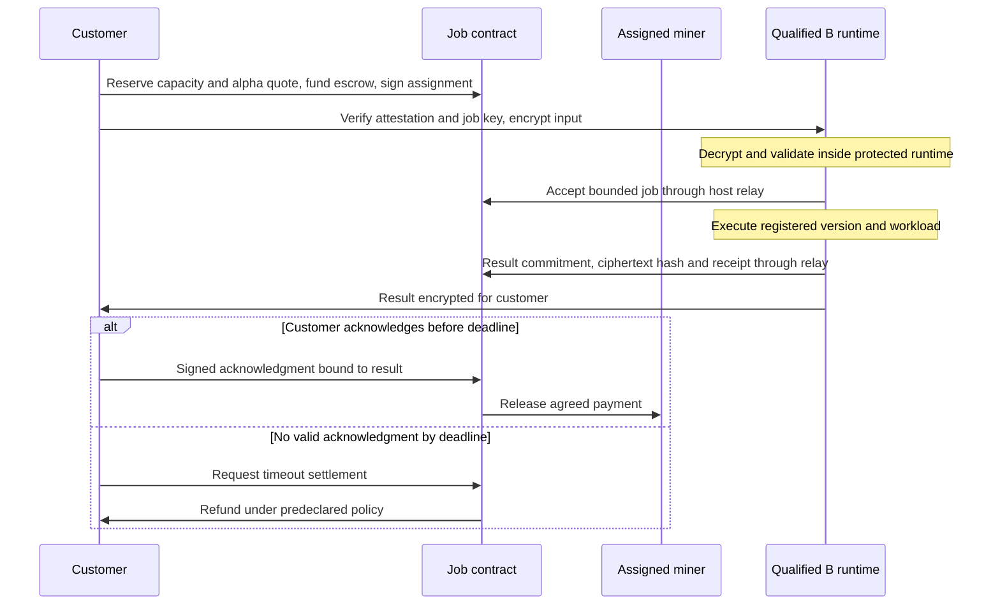

# Paid asynchronous inference

Design update, September 11, 2026, whitepaper draft 0.16.
Every paid B job requires qualified attested execution with independent
model/customer key release. B emissions and mandatory rewrite service require
the same qualified version and workload profile. Ordinary A hosting remains an
option with explicit customer acceptance. B weights remain private.
The [whitepaper](../whitepaper/slop_ninja.pdf), including its
[model policy](../whitepaper/sections/03-models.tex) and
[customer protocol](../whitepaper/sections/05-confidentiality.tex),
defines the canonical design. The implementation remains unqualified.

Proposal, updated 2026-09-11. The [whitepaper PDF](../whitepaper/slop_ninja.pdf)
([LaTeX source](../whitepaper/main.tex)) is the canonical design draft.
Customers buy asynchronous jobs at miner-quoted prices in subnet alpha from
providers hosting public A detectors or private B transformation models.
A hosting is optional; publishing a qualified artifact does not require an A
inference endpoint. Offers, assignments, commitments, escrow
and settlement belong on chain; B execution runs on qualified confidential
hardware, owned or rented by the miner. This repository
has no deployed job contract or paid serving endpoint yet.

Initial paid offers cover two task interfaces: A for author/origin detection,
and B for joint author-style transformation and detector evasion under the source
and brief. B targets both author fit and evasion of Pangram and the subnet's
qualified detectors. Audience, tone, readability and fidelity belong in
the transformation brief and its acceptance criteria.

Confidential B jobs pursue both objectives through local generation and
evaluation. Direct Pangram verification uses authorized benchmarks; a private
job cannot claim its own verified Pangram result without a separately authorized
disclosure. The joint objective grants no additional recipient access.

Both interfaces can earn hosted inference fees. A customers pay for compute
and delivery and can instead run the published model themselves. This outside
option can put downward pressure on hosted A prices; the protocol sets no
fixed A discount or A/B price ratio. Both prices come from competing quotes
denominated in alpha.

## Customer confidentiality

Every paid B job requires a qualified confidential runtime. The model owner
releases encrypted model material only after verifying that runtime; the customer
independently verifies its fresh attestation, loaded model commitment and job key.
The customer encrypts the source, references, profiles and brief to that key.
The operator cannot substitute an ordinary server key. It receives ciphertext
and permitted metadata, with no customer input key or plaintext output copy.

The public runtime must cover the complete CPU/GPU path, constrain private
weights to approved model data, deny content-bearing egress and telemetry, and
isolate and clear job state. No operator shell or guest administrator may inspect
the protected workload. Fixed workload buckets and response slots bound exposed
size/timing metadata. The trusted client must also disable active markup and
automatic remote fetches in model outputs. These are qualification requirements,
not capabilities demonstrated by this repository.

A weights remain public. A customer can run them locally, select a qualified
confidential service, or explicitly accept operator access through ordinary
hosting. Every offer must identify which policy applies.

The accepted runtime encrypts the result to the customer's delivery key. No
validator, support operator, storage provider or external model service receives
a default input key or output copy. Customer jobs cannot call Pangram, train on
the text, or enter benchmarks automatically. Authorized benchmarks have their
own specified recipients and external-evaluation permissions.

A customer can separately disclose selected evidence to one chosen validator.
Reassignment requires a new customer-signed assignment, freshly verified
instance and new envelope. A host cannot forward the job to an unapproved key.
Revocation cannot undo any disclosure already authorized under an earlier flow.

Hardware and measured software remain trusted. Attestation does not prove
editorial quality, prevent denial of service, or eliminate hardware side
channels. The full requirements and physical threat limits are in the
[customer protocol](../whitepaper/sections/05-confidentiality.tex).

## What belongs on chain

| Component | Proposed location | Evidence available |
| --- | --- | --- |
| Offers, assigned keys, acceptance and deadlines | Contract state/events | Agreed service and authorized participants |
| Deposits, acknowledgment, payment and timeout refunds | Contract | Deterministic accounting under the accepted policy |
| Salted input/result commitments and envelope hashes | Contract | Binding to exact bytes when an authorized recipient checks an opening |
| Source, references, profiles, brief and result | Encrypted transport/storage | Plaintext available only to the designated endpoints |
| Hosted inference and B search | Qualified confidential hardware for B; declared hosting mode for A | B receipt binds model/runtime and bounded workload; output quality requires independent evaluation |

All content-bearing fields stay inside the envelope. Public offer and job
metadata must not include excerpts, private profile values or the brief.
Keep commitment salts and openings encrypted as well. Ciphertext, hashes and
signatures do not establish useful delivery, decryptability or writing quality.

For small jobs, ciphertext could travel in transaction calldata/events so that
transport is also on chain. Measure 4, 16 and 64 KiB payloads on local/test chain,
including the customer and miner envelope overhead, before choosing a maximum.
On-chain transport exposes size, timing and counterparties and permanently
retains ciphertext that could become readable after key compromise. Off-chain
encrypted storage has the same recipient policy but its own availability limits.
Do not promise a fixed fee or treat block capacity as a per-subnet allowance.

Subtensor's EVM supports the proposed contract route without a new runtime
pallet. Deployment permissions and the alpha settlement adapter still need
implementation checks. Native hotkey commitments are quota-limited replacement
metadata, suitable for an epoch root rather than an append-only job database.
[Official EVM guide](https://www.bittensor.com/docs/guides/evm),
[deployment guide](https://www.bittensor.com/docs/guides/evm/deploy-a-contract),
[commitment types](https://github.com/RaoFoundation/subtensor/blob/67dcf7f791dc495064c293f080a0702cb433e51e/pallets/commitments/src/types.rs).

## Offer and job lifecycle

A signed offer binds the miner hotkey, authorized settlement identity, encryption
key, task schema, model/version and qualified runtime evidence, total alpha
quote for a bounded job,
available capacity, input/output limits, quote expiry, acceptance and delivery
deadlines, acknowledgment window and refund policy. Customers choose among
compatible offers using benchmark quality, deadline and price. Miners may change
future offers as demand, queue length, costs and competition change. There is
no owner-set base price, utilization target or global price-adjustment parameter.

An atomic reservation consumes offered capacity and locks the quoted alpha
amount and terms. Expired or exhausted offers cannot be filled, and later
repricing cannot change reserved jobs. The customer signs the assignment and
binds its delivery key. The B profile binds the bounded internal search and
padded workload; payment uses the reserved quote without exposing
content-dependent token counts. The service market determines
the alpha amount separately from the alpha/TAO exchange market.

Quote discovery uses public service descriptions and size/deadline metadata
the customer chooses to reveal. It sends no source, references, profiles or
brief plaintext to prospective bidders. The B envelope is addressed only to
the verified instance key. If the provider cannot serve under the reserved
terms, the job follows its rejection/refund policy; it cannot silently reprice
after decryption.

The proposed adapter would custody unlocked, transferable same-subnet alpha
using the staking-v2 interface and contract-held native stake. An allowance
alone does not reserve funds. Bind the subnet, hotkey position and alpha amount
in native units at `10^-9` precision. The service price and network/transfer fees
must be separate, with a named fee payer; funding must credit the quoted
principal. Release and refund must reconcile actual balances, transfer
restrictions and fees, keeping incidental accrual separate from job principal.
This adapter and accounting remain unimplemented and must be tested before
customer funds are accepted; no alpha ERC-20 interface is assumed.
[Staking-v2 interface](https://www.bittensor.com/docs/guides/evm/precompiles/staking-v2),
[stake from EVM](https://www.bittensor.com/docs/guides/evm/stake-from-evm).

The contract must authenticate the hotkey-to-EVM-address association. Copying
or truncating identifiers is not authorization. The documented sr25519
precompile verifies a signed 32-byte digest, whereas the existing envelope
prototype signs a variable-length message. Define versioned contract-signing
bytes and verify interoperability before binding either format to escrow.
[Key verification guide](https://www.bittensor.com/docs/guides/evm/verify-keys).

Before B acceptance, the protected runtime checks that the decrypted input opens
the commitment and fits the offer. The host cannot perform this plaintext check.
The exact brief remains inside that bound
input. Bind signatures and envelopes to chain, contract, job ID, participant
roles, assigned keys and nonce. Require final chain state and prevent duplicate
acceptance, acknowledgment or settlement.

Provide encrypted retrieval for the agreed retention window. A different
storage locator can carry the same recipient-bound envelope; it cannot change
who may decrypt. Deadline transitions require a transaction from a customer,
miner or keeper. Contracts do not wake themselves. Pin block-height or
chain-time semantics and account for finality. Rust remains the service/client
language; Solidity is the proposed EVM-contract exception.

## Payment without plaintext arbitration

The initial policy releases payment on a valid customer acknowledgment of the
committed result. Refund jobs that are not accepted or have no delivery claim
by their deadlines. A timely delivery claim starts the fixed acknowledgment
window; if it expires without acknowledgment, the remaining job escrow returns
to the customer. Bound every window before acceptance so funds cannot remain
locked indefinitely. Delivery claims or replacement ciphertext cannot extend
the absolute settlement deadline.

This is not fair exchange. A customer can read a useful result and withhold
acknowledgment, receiving the timeout refund. The miner bears that nonpayment
risk under this policy. Conversely, a miner can deliver unusable ciphertext or
an inadequate revision; a delivery claim alone never triggers payment. Small
job caps limit exposure but do not solve either incentive problem. Paid launch
still needs a settlement decision. The [consistency review](design-consistency-review.md#remaining-payment-decision)
describes a proposed execution-and-delivery policy; it is not yet the adopted rule.

Default settlement uses public protocol evidence, such as signatures, deadlines
and conflicting commitments. Validators or on-chain judges receive no plaintext
openings through that path and cannot decide whether a secret revision preserved
meaning or whether the customer obtained useful text. The protocol provides no
automatic plaintext arbitration or third-party delivery repair. A ciphertext
hash is not a proof of service quality.

For classification, correctness on an unknown customer input may have no
independent ground truth. Advertised benchmark accuracy remains distinct from
a guarantee for that job. Customers assess outputs and editing briefs privately.
A customer-initiated disclosure to another service creates a separate access
decision; it is not an implicit step in settlement.

## Optional customer-directed inspection

A customer can send a separate evidence packet to **one explicitly chosen
validator**. Authenticate that validator's encryption key before sending. The
customer signs and encrypts the packet, binding the chain, contract, job ID,
review context, recipient key, scope and nonce. Include the exact relevant
evidence and any commitment salts/openings needed for the requested checks.
The original input envelope and accepted execution policy remain unchanged.

The chosen validator sees only what the customer supplies. There is no standing
access, validator broadcast, miner rewrapping or automatic escalation. Disclosure
cannot be revoked after the validator has read it. Partial or redacted evidence
may not open the original whole-payload commitment; a hash of an excerpt does
not establish that it came from that committed payload. Incomplete evidence
cannot prove whole-job fidelity. A review must state which bindings it checked
and which context was unavailable.

Inspection can be advisory. A signed opinion should bind the job, evidence
packet hash and review scope. It affects escrow only under dispute terms and
validator authority accepted by both parties before job acceptance. Selecting
a reviewer alone cannot redirect funds, introduce a new settlement authority
or change deadlines. Otherwise the acknowledgment/no-ack refund policy applies,
and review does not pause its clock.

## Emissions, fees and serving

Benchmark emissions and customer revenue remain separate. Emissions reward
measured performance on authorized benchmark assignments, not claimed GPU
hours or customer transaction volume. A miner could buy its own jobs, so those
payments must not increase benchmark rewards. Benchmark validators may review
benchmark text under its own access policy.

The pilot assigns A to on-chain mechanism 0 and B to mechanism 1, with 50% of
emissions each. Editorial quality is part of B's gates and brief requirements.
The [reward rules](../whitepaper/sections/07-rewards.tex) also require fulfillment
of bounded mandatory free B rewrite service for A training requesters.
Only the actual A-requester and B-provider classes count; there is no mandatory
A-provider inference or B-requester prediction class. Removed classes do not
create zero-workload failures. A artifact qualification and validator benchmark
replay remain separate. More than 10% failed valid assigned task obligations
gives zero earned A and B credit for the measured epoch, with separate mandatory
gates for each interface and actually assigned requester/provider role, with no
automatic pass without assigned work. Each obligation binds its UID and role. Exactly
10% passes this availability gate. Paid jobs cannot dilute mandatory-service
failures. Measurement closes before the relevant weight deadlines; the published
payout lag does not claw back emissions already distributed.
Each mandatory interface/role must also clear its persistent recovery deficit
through actual same-class protocol probation work. Paid success, another service
class, elapsed time or key/service-version rotation cannot clear that deficit.

The alpha service quote covers local inference/search and agreed storage costs;
the offer separately identifies network/transfer fees and their payer. Miners
and validators separately fund their benchmark submissions and
review, including any required Pangram calls. Default private customer quotes
include neither automatic detector submissions nor validator reading fees.

Publish aggregate benchmark performance and public offers. Private customer
outputs and profiles stay out of leaderboards. Every credited B candidate and
mandatory B rewrite requires a qualified-runtime execution receipt. A paid offer
may cite a benchmark only for the same model/runtime and bounded search profile;
a cheaper or changed version needs its own evidence. Qualification is a binary
admission gate and earns no quality bonus. Attestation and benchmark evaluation
remain separate checks, both requiring implementation.

Serving can use signed `POST /jobs` with `202 Accepted`, followed by authenticated
polling or encrypted retrieval. Application transport remains the subnet's
responsibility; do not build around the removed Axon/Dendrite server
implementation. [SDK migration guide](https://www.bittensor.com/docs/migration#axon-dendrite-and-synapse-are-gone).

## Smallest next experiment

Use scripted synthetic jobs and test funds to check alpha funding and balance
accounting, capacity reservation, quote expiry, acknowledgment payment,
no-ack refund after a readable result, wrong recipient key, missing delivery,
changed commitment, replayed acknowledgment and attempted reassignment without
new customer authorization. Keep source/result openings at the two endpoints;
inspect only public evidence for settlement. Record recipient access, terminal
payments and duplicate prevention. No model training or Pangram call is needed.

The existing [receipt envelope](receipt-envelope.md) is a cryptographic building
block. Its validator-recipient benchmark schema is not a customer-job envelope
or escrow implementation. A customer-specific schema must enforce the verified
B instance input key and customer result key before deployment.
