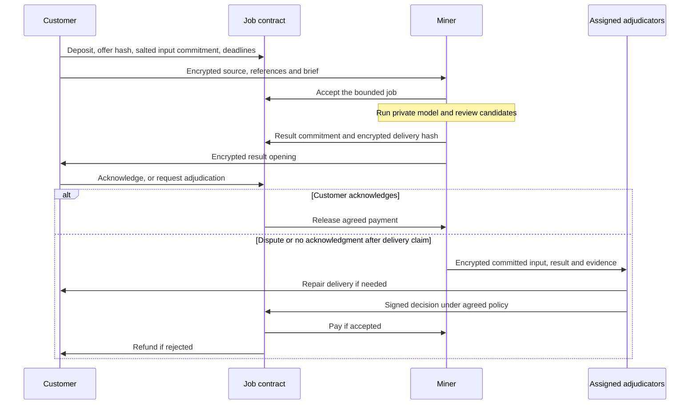

# Paid asynchronous inference

Proposal, 2026-09-09. Customers buy jobs from miners who retain their private
models. Use on-chain offers, job commitments, escrow and settlement, with model
execution on miners' hardware. An asynchronous interface gives miners time to
batch requests, search candidate edits and complete review before delivery.

Subtensor supports standard EVM contracts and native TAO payments. A custom job
contract can implement this application without a new runtime pallet. This
repository has no deployed contract or paid serving endpoint yet.
[Official EVM guide](https://www.bittensor.com/docs/guides/evm),
[deployment guide](https://www.bittensor.com/docs/guides/evm/deploy-a-contract).

## What belongs on chain

| Component | Proposed location | Reason |
| --- | --- | --- |
| Offers, acceptance, deadlines, opaque model versions | Contract state/events | Customers and miners can check the same agreed job |
| Deposits, payment, refunds, dispute decisions | Contract | Deterministic accounting under a fixed settlement policy |
| Salted input/result commitments and encrypted-envelope hashes | Contract | Bind later evidence without publishing the text |
| Private input, reference writing, result and provider receipts | Encrypted delivery/storage by default | Avoid putting large, permanently recoverable ciphertext in every job transaction |
| Trained weights, adapters, search and inference | Miner hardware | Keep model internals private and avoid replicated chain computation |
| Preservation and writing-quality judgments | Agreed validators/readers | Contracts can check signed decisions; they cannot infer literary or factual quality from a hash |

For small jobs, encrypted payloads could travel in transaction calldata/events
if measurements justify it. That would put job transport on chain as well.
It would still expose sizes, timing and counterparties, and persist ciphertext
after key compromise. Benchmark 4, 16 and 64 KiB payloads on local/test chain,
including profile and audit-recipient overhead, before choosing a maximum.
Do not treat block capacity as a per-subnet allowance or promise a fixed fee.

Native hotkey commitments are a small replacement metadata record with field
and epoch quotas. Use them for an epoch root where appropriate; they are not
an append-only job database. See the pinned
[commitment types](https://github.com/RaoFoundation/subtensor/blob/67dcf7f791dc495064c293f080a0702cb433e51e/pallets/commitments/src/types.rs)
and [pallet behavior](https://www.bittensor.com/code/pallets/commitments/src/lib.rs).

## Offer and job lifecycle

A miner offer binds its hotkey, authorized payment address, supported task
schemas, model version, encryption key, price, capacity, length limits, delivery
deadline and dispute policy. The customer chooses a miner and locks a fixed
quote. Start with a fixed price for a bounded job so neither side can inflate
an unverifiable internal token or search count.

The contract must authenticate the association between a miner hotkey and EVM
payment address. They use different signing/address systems; copying or
truncating an identifier is not an authorization step. Check live deployment
permissions and signature support when implementing the contract.
The documented sr25519 precompile verifies a signed 32-byte digest; it cannot
directly verify our local envelope's raw, variable-length message signature.
Define separate versioned contract-signing bytes and verify interoperability
before binding either format to escrow.
[Key verification guide](https://www.bittensor.com/docs/guides/evm/verify-keys).

Before acceptance, the miner decrypts and checks that the input opens the job
commitment and fits its offer. It must receive the public constraints needed
to judge acceptance; hidden benchmark answers remain with validators. A job
cannot be accepted under one brief and disputed under a later changed brief.
Bind every signature to chain, contract, job ID, role and nonce. Accept final
chain state and prevent duplicate delivery or settlement.

After acceptance, bind the exact delivered bytes to the result commitment and
registered customer key. Provide locator-independent retrieval or redundant
encrypted storage for the agreed retention window. A hash proves consistency
of bytes only after retrieval; it does not establish availability or decryptability.

Deadline transitions require a submitted transaction. A customer, miner or
keeper can call the relevant transition; contracts do not wake themselves to
pay a refund. Pin whether deadlines use block height or chain time, and account
for finality. Use Rust for the service, client and accounting tools; Solidity is
the proposed exception for the EVM contract.

## Fair payment needs an agreed judge

Customer acknowledgment is the fast settlement path. Refund an unaccepted job,
or an accepted job for which no delivery was claimed by its deadline. Once the
miner claims delivery, silence or rejection opens adjudication: automatically
refunding would let a customer consume useful text for free, while automatically
paying would reward unreadable ciphertext. Every disputed job needs a resolution
path, even when only a sample of ordinary jobs receives quality audits.

Fix the eligible adjudicator roster and policy before acceptance. The intended
network version uses independently selected adjudicators and a quorum;
randomness selection and their signatures must be verifiable. This still
depends on an honest quorum. Customers explicitly accept disclosure to those
adjudicators when requesting an arbitrated job. Evidence and provider links stay
encrypted; a public decision contains only the minimum accounting result.

For a delivery dispute, an adjudicator checks the opening against the input and
result commitments and can re-encrypt the same verified result to the registered
customer key. This prevents a miner from presenting useful plaintext to judges
while sending the customer an unusable envelope. Delivery repair has its own
deadline. A receipt does not prove that the customer actually read the result.

If adjudicators cannot resolve the job, apply a bounded terminal fallback fixed
in the offer. A refund fallback assigns adjudicator-availability risk to the
miner, including cases where the customer already read the result. Start with
small capped test jobs and record those losses. We have no trustless solution
to subjective editorial disputes, and should not claim one from encryption,
drand or Pangram alone.

For plain classification purchases, accuracy cannot be determined for each
unknown real-world input. The offer guarantees the response schema, delivery
and advertised evaluation record; per-job correctness claims need independent
ground truth. For editing purchases, acceptance follows the explicit brief.
Pangram measurement is an optional quoted add-on for customer work and mandatory
where the subnet's evasion benchmark requires it. A sub-10% report does not
certify preserved meaning or human authorship.

## Emissions, fees and model privacy

Keep customer revenue and benchmark emissions separate. Emissions reward
performance on private assignments, which creates a reason to invest in
training. They do not reimburse claimed GPU hours. Customer payments reward
completed service under the chosen offer. Customer transaction volume alone
must not increase benchmark rewards; a miner could buy its own jobs.

The customer quote covers miner inference/search, any requested detector
submissions, adjudication allowance and agreed transaction/storage costs.
Miners fund their benchmark submissions and private optimization; validators
fund their own review, with baseline/query subsidies accounted for explicitly.
No assumption of free validator operation follows from free report retrieval.

Publish aggregate task performance, completion rates and price/capacity offers.
Keep individual report links, text, profiles and trained weights private.
Opaque model versions identify offers and responses; they do not prove which
weights were executed. Ordinary black-box evaluation also cannot enforce hidden
search budgets or prevent miner-to-miner outsourcing. Measure response deadlines
and paid price instead. Stronger execution attestation is a separate project.

Serving can use signed `POST /jobs` with `202 Accepted`, then authenticated
polling or encrypted batch retrieval. Current Bittensor SDK documentation leaves
application transport to subnet developers and supplies request authentication;
do not build around the removed Axon/Dendrite server implementation.
[SDK migration guide](https://www.bittensor.com/docs/migration#axon-dendrite-and-synapse-are-gone).

## Smallest next experiment

Use eight scripted synthetic jobs, prepared outputs and test funds, with one
explicitly trusted operator-adjudicator: honest delivery; consumed result with
withheld acknowledgment; altered protected fact; wrong recipient key; missing
delivery; a changed commitment opening; replayed acknowledgment; adjudicator
outage. Record final payment, duplicate prevention, time to resolution and
repaired delivery. No model training or Pangram query is needed for this test.

Then replace the operator with multiple independent adjudicators and test the
same cases before adding real customer funds. The existing
[receipt envelope](receipt-envelope.md) supplies a cryptographic building block;
its validator-specific schema is not yet a customer-job or escrow implementation.
