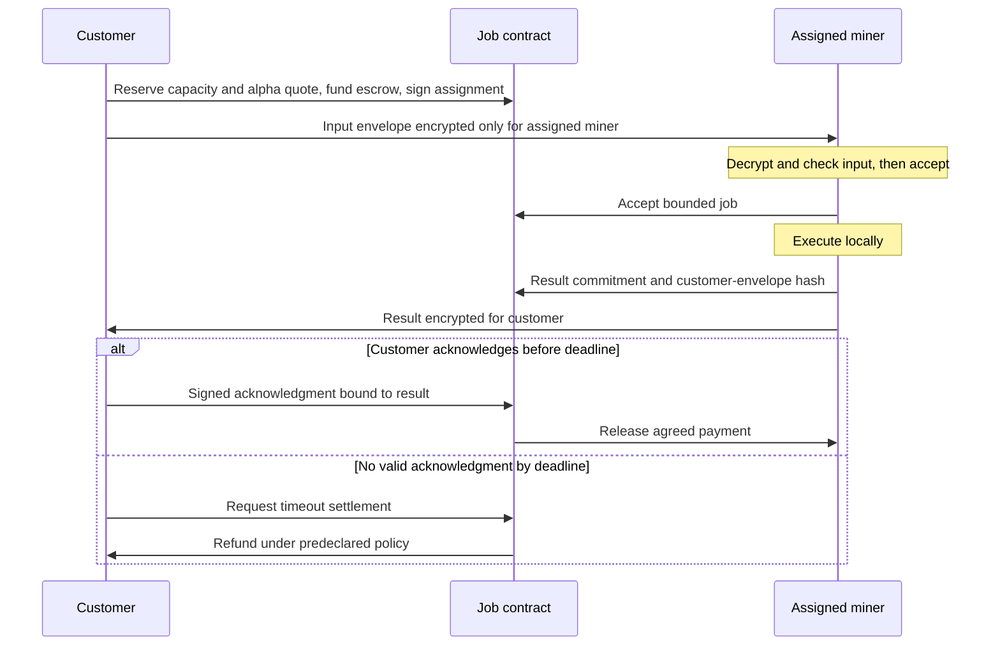

# Paid asynchronous inference

Proposal, 2026-09-09. The [whitepaper PDF](../whitepaper/slop_ninja.pdf)
([LaTeX source](../whitepaper/main.tex)) is the canonical design draft.
Customers buy asynchronous jobs at miner-quoted prices in subnet alpha from
miners who retain their private models. Offers, assignments, commitments, escrow
and settlement belong on chain; model execution runs on the assigned miner's
hardware. This repository
has no deployed job contract or paid serving endpoint yet.

## Customer confidentiality

Every customer inference input, including source text, reference writing,
profiles and the complete brief, is encrypted by the customer for **only the
assigned miner**, besides the customer's own access. In the default job flow,
validators, auditors, customer-service operators and external model or detector
providers receive no decryption key or automatic copy. Storage and transport
services may carry ciphertext. They are not additional plaintext recipients.

The miner encrypts the result for the customer's registered delivery key.
The protocol does not automatically copy the source or result to validators,
including during a payment dispute. No standing escrow, recovery or audit key
grants a third party access. A customer may separately disclose selected evidence
to one chosen validator under the process below.
The miner necessarily sees the plaintext it processes and produces. Private
weights and encryption in transit cannot prevent that miner from leaking it.
Retention, deletion and local-execution promises remain service obligations;
this design does not cryptographically attest compliance.

Confidential jobs require local model execution. They cannot outsource content
to another miner, a hosted model API or Pangram. Detector measurements and
public reports disclose content and are incompatible with this exclusive
recipient policy. A customer may separately initiate a different flow with
explicitly expanded recipients, but that is outside the default private job.
Buying an inference job does not authorize training or benchmark reuse.

Reassignment is never automatic. A customer must issue a new signed assignment
and a new envelope for the new miner. The original miner cannot forward the
input or re-encrypt it to a replacement on the customer's behalf. Changing an
assignment also cannot revoke plaintext already received by the first miner.

Benchmark-owned tasks have separate access rules: their authorized validators
and, where required, Pangram can receive benchmark text. Those permissions do
not extend to customer jobs.

## What belongs on chain

| Component | Proposed location | Evidence available |
| --- | --- | --- |
| Offers, assigned keys, acceptance and deadlines | Contract state/events | Agreed service and authorized participants |
| Deposits, acknowledgment, payment and timeout refunds | Contract | Deterministic accounting under the accepted policy |
| Salted input/result commitments and envelope hashes | Contract | Binding to exact bytes when an authorized recipient checks an opening |
| Source, references, profiles, brief and result | Encrypted transport/storage | Plaintext available only to the designated endpoints |
| Weights, adapters, search and inference | Assigned miner hardware | Private execution; no proof of which weights ran |

All content-bearing fields stay inside the envelope. Public offer and job
metadata must not include excerpts, private profile values or the brief.
Keep commitment salts and openings encrypted as well. Ciphertext, hashes and
signatures do not establish useful delivery, decryptability or writing quality.

For small jobs, ciphertext could travel in transaction calldata/events so that
transport is also on chain. Measure 4, 16 and 64 KiB payloads on local/test chain,
including the customer and miner envelope overhead, before choosing a maximum.
On-chain transport exposes size, timing and counterparties and permanently
retains ciphertext that could become readable after key compromise. Off-chain
encrypted storage has the same recipient policy but its own availability limits.
Do not promise a fixed fee or treat block capacity as a per-subnet allowance.

Subtensor's EVM supports the proposed contract route without a new runtime
pallet. Deployment permissions and the alpha settlement adapter still need
implementation checks. Native hotkey commitments are quota-limited replacement
metadata, suitable for an epoch root rather than an append-only job database.
[Official EVM guide](https://www.bittensor.com/docs/guides/evm),
[deployment guide](https://www.bittensor.com/docs/guides/evm/deploy-a-contract),
[commitment types](https://github.com/RaoFoundation/subtensor/blob/67dcf7f791dc495064c293f080a0702cb433e51e/pallets/commitments/src/types.rs).

## Offer and job lifecycle

A signed offer binds the miner hotkey, authorized settlement identity, encryption
key, task schema, opaque model version, total alpha quote for a bounded job,
available capacity, input/output limits, quote expiry, acceptance and delivery
deadlines, acknowledgment window and refund policy. Customers choose among
compatible offers using benchmark quality, deadline and price. Miners may change
future offers as demand, queue length, costs and competition change. There is
no owner-set base price, utilization target or global price-adjustment parameter.

An atomic reservation consumes offered capacity and locks the quoted alpha
amount and terms. Expired or exhausted offers cannot be filled, and later
repricing cannot change reserved jobs. The customer signs the assignment and
binds its delivery key. Internal token and search counts are not independently
observable, so payment uses the bounded quote. The service market determines
the alpha amount separately from the alpha/TAO exchange market.

Quote discovery uses public service descriptions and size/deadline metadata
the customer chooses to reveal. It sends no source, references, profiles or
brief plaintext to prospective bidders. Only the selected miner receives the
input envelope. If that miner cannot serve the request under the reserved
terms, the job follows its rejection/refund policy; it cannot silently reprice
after decryption.

The proposed adapter would custody unlocked, transferable same-subnet alpha
using the staking-v2 interface and contract-held native stake. An allowance
alone does not reserve funds. Bind the subnet, hotkey position and alpha amount
in native units at `10^-9` precision. The service price and network/transfer fees
must be separate, with a named fee payer; funding must credit the quoted
principal. Release and refund must reconcile actual balances, transfer
restrictions and fees, keeping incidental accrual separate from job principal.
This adapter and accounting remain unimplemented and must be tested before
customer funds are accepted; no alpha ERC-20 interface is assumed.
[Staking-v2 interface](https://www.bittensor.com/docs/guides/evm/precompiles/staking-v2),
[stake from EVM](https://www.bittensor.com/docs/guides/evm/stake-from-evm).

The contract must authenticate the hotkey-to-EVM-address association. Copying
or truncating identifiers is not authorization. The documented sr25519
precompile verifies a signed 32-byte digest, whereas the existing envelope
prototype signs a variable-length message. Define versioned contract-signing
bytes and verify interoperability before binding either format to escrow.
[Key verification guide](https://www.bittensor.com/docs/guides/evm/verify-keys).

Before acceptance, the assigned miner checks that the decrypted input opens
the commitment and fits the offer. The exact brief remains inside that bound
input. Bind signatures and envelopes to chain, contract, job ID, participant
roles, assigned keys and nonce. Require final chain state and prevent duplicate
acceptance, acknowledgment or settlement.

Provide encrypted retrieval for the agreed retention window. A different
storage locator can carry the same recipient-bound envelope; it cannot change
who may decrypt. Deadline transitions require a transaction from a customer,
miner or keeper. Contracts do not wake themselves. Pin block-height or
chain-time semantics and account for finality. Rust remains the service/client
language; Solidity is the proposed EVM-contract exception.

## Payment without plaintext arbitration

The initial policy releases payment on a valid customer acknowledgment of the
committed result. Refund jobs that are not accepted or have no delivery claim
by their deadlines. A timely delivery claim starts the fixed acknowledgment
window; if it expires without acknowledgment, the remaining job escrow returns
to the customer. Bound every window before acceptance so funds cannot remain
locked indefinitely. Delivery claims or replacement ciphertext cannot extend
the absolute settlement deadline.

This is not fair exchange. A customer can read a useful result and withhold
acknowledgment, receiving the timeout refund. The miner bears that nonpayment
risk under this policy. Conversely, a miner can deliver unusable ciphertext or
an inadequate revision; a delivery claim alone never triggers payment. Small
job caps limit exposure but do not solve either incentive problem.

Default settlement uses public protocol evidence, such as signatures, deadlines
and conflicting commitments. Validators or on-chain judges receive no plaintext
openings through that path and cannot decide whether a secret revision preserved
meaning or whether the customer obtained useful text. The protocol provides no
automatic plaintext arbitration or third-party delivery repair. A ciphertext
hash is not a proof of service quality.

For classification, correctness on an unknown customer input may have no
independent ground truth. Advertised benchmark accuracy remains distinct from
a guarantee for that job. Customers assess outputs and editing briefs privately.
A customer-initiated disclosure to another service creates a separate access
decision; it is not an implicit step in settlement.

## Optional customer-directed inspection

A customer can send a separate evidence packet to **one explicitly chosen
validator**. Authenticate that validator's encryption key before sending. The
customer signs and encrypts the packet, binding the chain, contract, job ID,
review context, recipient key, scope and nonce. Include the exact relevant
evidence and any commitment salts/openings needed for the requested checks.
The original input envelope and assigned-miner route remain unchanged.

The chosen validator sees only what the customer supplies. There is no standing
access, validator broadcast, miner rewrapping or automatic escalation. Disclosure
cannot be revoked after the validator has read it. Partial or redacted evidence
may not open the original whole-payload commitment; a hash of an excerpt does
not establish that it came from that committed payload. Incomplete evidence
cannot prove whole-job fidelity. A review must state which bindings it checked
and which context was unavailable.

Inspection can be advisory. A signed opinion should bind the job, evidence
packet hash and review scope. It affects escrow only under dispute terms and
validator authority accepted by both parties before job acceptance. Selecting
a reviewer alone cannot redirect funds, introduce a new settlement authority
or change deadlines. Otherwise the acknowledgment/no-ack refund policy applies,
and review does not pause its clock.

## Emissions, fees and serving

Benchmark emissions and customer revenue remain separate. Emissions reward
measured performance on authorized benchmark assignments, not claimed GPU
hours or customer transaction volume. A miner could buy its own jobs, so those
payments must not increase benchmark rewards. Benchmark validators may review
benchmark text under its own access policy.

The alpha service quote covers local inference/search and agreed storage costs;
the offer separately identifies network/transfer fees and their payer. Miners
and validators separately fund their benchmark submissions and
review, including any required Pangram calls. Default private customer quotes
include neither automatic detector submissions nor validator reading fees.

Publish aggregate benchmark performance and public offers. Private customer
outputs and profiles stay out of leaderboards. Opaque model versions do not
prove execution, and black-box evaluation cannot enforce hidden search budgets
or prevent a dishonest miner from outsourcing plaintext. Local execution is
required by the confidential-job policy; proving it would need additional
mechanisms.

Serving can use signed `POST /jobs` with `202 Accepted`, followed by authenticated
polling or encrypted retrieval. Application transport remains the subnet's
responsibility; do not build around the removed Axon/Dendrite server
implementation. [SDK migration guide](https://www.bittensor.com/docs/migration#axon-dendrite-and-synapse-are-gone).

## Smallest next experiment

Use scripted synthetic jobs and test funds to check alpha funding and balance
accounting, capacity reservation, quote expiry, acknowledgment payment,
no-ack refund after a readable result, wrong recipient key, missing delivery,
changed commitment, replayed acknowledgment and attempted reassignment without
new customer authorization. Keep source/result openings at the two endpoints;
inspect only public evidence for settlement. Record recipient access, terminal
payments and duplicate prevention. No model training or Pangram call is needed.

The existing [receipt envelope](receipt-envelope.md) is a cryptographic building
block. Its validator-recipient benchmark schema is not a customer-job envelope
or escrow implementation. A customer-specific schema must enforce the single
assigned-miner input recipient and customer result recipient before deployment.
