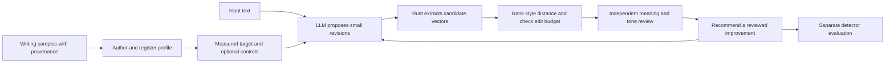

# Author-conditioned editing

The prototype fits an author's observed choices within a writing register, then
uses that profile to guide and score LLM edit proposals. The target is a measured
distribution with variation across source works. It does not claim to recover an
exact, unique point identifying the writer.



The constraint operates outside the LLM: it receives measured differences and a
small edit budget, and Rust remeasures its actual output. This does not modify the
model's hidden states or make its decoder obey a hard grammatical constraint.
`style-plan` prepares prompts for the existing `collect` command; `style-rank`
checks a returned batch. The caller starts another step from a reviewed revision.
No source file is automatically replaced.

## Implemented coordinates

The feature space has its own versioned identity, including the existing lexical
extractor and, when enabled, the exact spaCy/parser version. It does not change
the earlier corpus extractor or silently mix old measurements with these vectors.

| Family | Representation | Opportunity or unit |
| --- | --- | --- |
| `lexicon` | Lowercased word distribution, retained for optional comparison | Rust lexical words; default ranking weight zero |
| `function_word` | Fixed English surface-word rates, including zeros | All Rust lexical words |
| `sentence_length` | Distribution over existing length buckets | Heuristic sentences |
| `punctuation` | Fixed punctuation rates | Unicode scalar values in the original text |
| `discourse_surface` | Versioned connective spellings, matched within sentences | Rust lexical words; these are string matches, not discourse labels |
| `rhythm` | Mean, SD and p90 sentence length; words per paragraph | Words; scale floor 2 |
| `lexical_shape` | Mean letters per word; long-word and contraction fractions | Letters with floor 0.25; fractions with floor 0.02 |
| `pos`, `dependency` | Parser POS and head/relation/dependent patterns | Existing parser token counts |
| `pos_bigram`, `pos_trigram`, `function_pattern` | Within-sentence grammatical sequences | Eligible parser windows |
| `construction` | Fixed binary sentence patterns, including absent patterns | Parsed sentences |

The construction inventory includes passive, relative, adverbial and complement
clauses, coordination, apposition, negation, noun/pronoun subjects, existential
*there*, first-person reference and copular constructions. Counts can overlap;
their denominator is sentences, not the sum of construction counts. Grammar
families require `--grammar`; Python only runs the existing spaCy adapter.

The [research and grammar specification](style-research.md) covers the next
features: semantic subject classes, richer clause topology, dependency depth,
discourse relations, repetition and scope-aware argument annotations. These
require additional extractors or labelled data. A `NOUN` subject alone cannot
establish abstract agency or anthropomorphic rhetoric.

## Reference and distance

`style-fit` selects one declared author and register from training rows. It
requires at least two distinct source groups, rejects duplicate reference hashes,
and prevents exact texts or source groups from crossing declared splits. It
averages document rates within each work, then gives each observed work equal
weight. Save multiple windows from the same work with the same `group_id`.

For each coordinate, the profile retains the mean and population SD of group
means, source hashes, opportunities and reference distances. This SD describes
the supplied works; it is not a confidence interval. A family can have fewer
observed groups when some samples provide no opportunities. More independent
works and held-out author samples are needed to evaluate the profile.

For categorical distributions, the prototype uses Hellinger distance over the
union of observed and reference features. New feature mass therefore counts;
adding many unfamiliar words cannot dilute the score by increasing dimension
count. For rates and metrics it uses RMS standardized differences, scaled by
`max(reference SD, feature floor)`, capped at 10 SD units and divided by 10.
The aggregate is a weighted average of available family distances.

Default family weights are one, except for the open lexicon's zero. Function
words still contribute. This initial choice reduces direct topic matching; it
does not remove topic or register effects. Floors, caps and family weights are
explicit heuristics, ready for evaluation rather than learned author invariants.
No dimension is labelled inherently good, human or AI-like.

Lower distance means closer to this target under this metric. It is not an
authorship probability, an accessibility grade, a semantic score, or a Pangram
prediction. Both baseline and candidate must have complete positive-weight
family coverage before ranking can recommend an improvement.

## Controls

`style-controls` produces an editable artifact tied to the exact profile.
Strengths range from -2 to 2; zero adds no control shift to the author target.

- Positive `--accessibility` requests lower mean and p90 sentence length and a
  smaller long-word fraction. These are explicit heuristic shifts in reference
  SD/floor units. Requested, bounded and representable targets are recorded.
  Comprehension, jargon knowledge and retained argument steps still need review.
- `--rhetorical-strength` supplies a qualitative instruction about force and
  emphasis. It does **not** alter certainty or automatically remove hedges. There
  is no calibrated rhetorical-strength vector direction yet. The reviewer must
  assess whether the requested presentation changed without changing the claims.
- `--lexicon-weight` enables topical word-distribution distance explicitly. Its
  contribution and the other family weights remain visible in each comparison.

The `vector_target` object also accepts explicit family weights and coordinate
shifts, for example `{"family":"rhythm","feature":"mean_sentence_words",
"delta_sd":-0.5}`. Invalid features, negative weights, duplicate shifts and
impossible target values are rejected. Categorical coordinate shifts are not
supported because they would require jointly renormalizing a distribution.

To learn a rhetorical direction, collect paired examples of the same claims with
different presentation, label the achieved rhetorical change and preservation,
and estimate the direction within author/register strata. Audience controls need
paired revisions and comprehension judgments from that audience. Evaluate those
directions on separate works before turning them into numeric sliders.

## Local workflow

Writing samples use JSONL. Each row supplies `id`, `author_id`, `group_id`,
`register`, `split`, `authorship` and `text`. `split` must be `train`, `dev` or
`test`. Authorship is `user_declared_human`, `unknown` or `synthetic_fixture`;
the software records the declaration without certifying it. Use writing produced
without AI assistance for a personal reference and reserve complete works for tests.

The checked-in examples are **synthetic fixtures**, not the user's writing:

```sh
cargo build --release
target/release/unslop style-fit examples/style-samples.jsonl \
  --author synthetic-demo --register technical-explanation --grammar \
  --out data/style-demo/profile.json
target/release/unslop style-compare data/style-demo/profile.json \
  examples/style-source.txt --out data/style-demo/baseline.json
target/release/unslop style-controls data/style-demo/profile.json \
  --accessibility 0.5 --rhetorical-strength 1 \
  --out data/style-demo/controls.json
target/release/unslop style-plan data/style-demo/profile.json \
  examples/style-source.txt --target data/style-demo/controls.json \
  --candidates 3 --max-edit-ratio 0.15 --out data/style-demo/prompts.jsonl
```

The plan makes no model calls. To generate proposals, use the existing collector
with a model and budget. This command consumes model usage:

```sh
target/release/unslop collect data/style-demo/prompts.jsonl \
  --provider codex-cli --model gpt-6-astra --corpus style-demo-proposals \
  --out data/style-demo/generated.jsonl --max-requests 3
target/release/unslop style-rank data/style-demo/profile.json \
  examples/style-source.txt data/style-demo/generated.jsonl \
  --target data/style-demo/controls.json --max-edit-ratio 0.15 \
  --out data/style-demo/ranking.json
```

For an offline demonstration, rank `examples/style-candidates.jsonl` without a
target. It contains a faithful sentence split and a meaning-changing deletion.
Both may move toward the style target. The deletion removes a negation, so a
meaning review must reject it regardless of its score.

```sh
target/release/unslop style-rank data/style-demo/profile.json \
  examples/style-source.txt examples/style-candidates.jsonl \
  --max-edit-ratio 0.3 --out data/style-demo/unreviewed-ranking.json
```

The [recorded synthetic demonstration](../experiments/style-vector-v1/demo.json)
used three training works, excluded one held-out work, and extracted 13 feature
families with grammar enabled:

| Text | Style distance | Independent assistant review | Recommended |
| --- | ---: | --- | --- |
| Source | 0.4040 | Baseline | |
| Faithful sentence split | 0.2125 | Passed | Yes, after review |
| Negation removed, claim reversed | 0.2059 | Failed | No |

Neither revision was recommended before review. The lower-scoring invalid edit
shows why a meaning failure cannot be compensated by style similarity. This is
a test of the local workflow on constructed examples. It does not measure
personal author matching or detector performance; no external generation or detector
requests were made for this demonstration.

## Selection and records

The edit budget uses case-sensitive Unicode word, number and punctuation token
Levenshtein distance divided by the source token count. Whitespace is ignored.
This limits the extent of a proposal; it cannot tell whether one changed word
reversed a claim. A numeric-sequence check catches some obvious changes, including
sign changes, but is only a preliminary filter.

Ranked candidates include full measured differences and a review template with
all preservation flags false. A supplied review must match the exact source,
candidate, profile and controls hashes. It must state meaning, detail, tone,
readability and control satisfaction. Assistant judgments remain labelled as
assistant judgments; the tool does not create human attestations.

Without a passing review, `recommended_candidate_id` remains null. Even with a
review, a proposal must improve style distance, fit the edit budget, preserve the
numeric sequence, cover every positively weighted family, and avoid an exact copy
of a reference sample. Collected proposals bind their source/profile/control
provenance; manually supplied proposals are explicitly marked unbound. Exact
reference overlap in the input is reported so it cannot look like a held-out test.

Store samples, profiles, generated candidates, reviews and detector results under
ignored `data/`. Output artifacts refuse conflicting overwrites. The original
source stays intact. Detector scans belong after preservation and style review,
using the existing whole-document repeated-study workflow. Whether author matching
lowers detection is still an empirical question for new source families.
