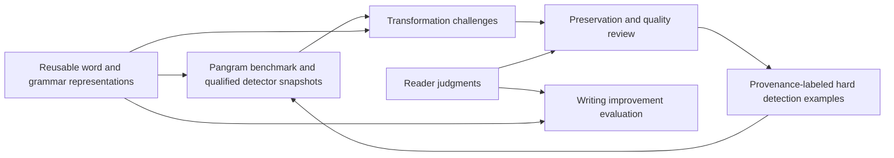

# slopninja subnet mechanisms

Status: design proposal, 2026-09-09. We have enough evidence to define an
offline competition. Paid validation still needs a suitable private benchmark,
measured judge reliability and an authenticated challenge ledger.

The [whitepaper PDF](../whitepaper/slopninja.pdf)
([LaTeX source](../whitepaper/main.tex)) is the current overall design. The scoring
and audit access below apply to subnet-owned benchmarks. Customer inference
inputs are encrypted only for their assigned miner; a customer may separately
send evidence to a specific validator. Those disclosures do not authorize
general validator access or automatic benchmark reuse.

The subnet should develop three capabilities: recognizing authors and production
histories, transforming text toward a requested voice, and improving writing
for a stated audience. Miners can improve the grammar and word representation,
the task models, or the editing process. The existing model supplies a baseline;
we do not need to perfect it before testing these incentives.

Miners keep their trained models private and serve authenticated task requests.
The [model and data plan](miner-models-and-data.md) defines starter architectures
and training records; the [paid inference proposal](paid-inference.md) adds
customer jobs with on-chain settlement. Emissions reward observed performance,
while customers pay separately for service. No weight publication is required.

Pangram is the required external benchmark for origin detection and detector
evasion. Compare detectors against documented production histories alongside
Pangram, and measure evasion against Pangram itself. The [API verification and
funding design](pangram-oracle.md) specifies that dependency and its remaining
trust assumptions. Other detectors supply supplementary challenges.

## Three tasks, two chain mechanisms

Bittensor's current documentation caps a subnet at two on-chain mechanisms.
Each has independent weights and consensus; participants share UIDs. Validators
select a mechanism using `mechid`. We can preserve three task scores by grouping
the two revision tasks into the second mechanism. This is a proposed application
design, not a claim that three independent chain mechanisms are available.
[Mechanism documentation](https://www.bittensor.com/docs/guides/subnets#mechanisms),
[weight submission](https://www.bittensor.com/docs/tx/set-weights).

| Logical task | Miner produces | Main evaluation | Proposed chain mechanism |
| --- | --- | --- | --- |
| Detection | Author probabilities and separately evaluated origin probabilities | Known author and documented production history | 0 |
| Transformation | A revision matching a requested author/style, optionally with detector evasion | Preservation, independent style assessment and Pangram measurement | 1, transformation score pool |
| Writing improvement | A revision for a supplied audience and editorial brief | Preservation and blinded reader preference | 1, quality score pool |

Keep independent score tables and fixed task allocations before combining
weights. Otherwise cheap detection requests or a permissive quality judge could
consume the entire reward budget. Miners may specialize; they receive credit
only in the task pools they enter. Exact allocation percentages remain a pilot
parameter, not an established economic result.

## 1. Author and origin detection

An author task supplies a query and reference samples labeled with opaque author
IDs. The initial benchmark uses a fixed gallery of 100 authors, matching our
existing evaluation. The miner returns a probability distribution over that
gallery. Unknown-author rejection needs separately allocated unknown examples
and calibration before joining the reward.

An origin task supplies text and asks for probabilities over explicitly defined
production histories. Human-only writing, model drafts and mixed revision
workflows require different provenance records. A detector verdict, publication
date or resemblance to a person cannot establish those labels. A transformed
model draft retains its recorded production history even if every detector
misclassifies it.

Use the multiclass Brier score for each task:

```text
B = 1 - 0.5 * sum_k((p_k - y_k)^2)
```

Here `p` is the submitted probability vector and `y` is the known one-hot label.
Score author and origin tasks separately, balancing authors/source groups before
aggregation. Report author retrieval accuracy and reciprocal rank, and origin
calibration, human false-positive rate and recall at a development-fixed
threshold. Define acceptable false-positive rates before reward evaluation.

For the offline payout simulation, use positive aggregate improvement over a
fixed public baseline, scaled by that baseline's remaining headroom. A uniform
100-author predictor already receives a high raw Brier score, so raw score
normalization would give substantial credit for guessing. The probability
metric and its later conversion into relative rewards are separate operations.

Keep reference dates earlier than query dates. Separate authors across fitting,
selection and final model evaluation; separate complete source families and all
their revisions across origin splits. Match domains, assignments and length
distributions across origins. Include same-author/different-topic and
different-author/similar-topic challenges, and hold out generation families.
Known hard human examples are essential to prevent an always-AI classifier
from winning against a pool dominated by generator submissions.

Miners serve a versioned author/origin prediction interface. They can retain
`encode(text)` and `profile(samples)` internally, including proprietary grammar
features and learned embeddings. Our public starter implementation exposes named
features, denominators and missingness for reproducibility; competitors need not
publish their implementation. Validators authenticate responses and score them
against held-out labels. A declared model version does not prove which private
weights ran. Reward measured performance rather than dimension count.

## 2. Author transformation and detector evasion

A challenge supplies source text, target reference samples, intended tone,
audience, allowed style changes and preservation requirements. It declares
`author_style`, `detector_evasion` or `both`; these modes retain separate results.
The output is exact revised text bound to the source and submitted model version.

First assess preservation of claims, participants, quantities, qualifications,
citations and argument relationships. Require readability and intended tone to
meet the brief. A failed requirement earns zero transformation utility, however
good the style or detector score. An unresolved review remains pending or
unscored under the round policy; it cannot pass by default.

Among revisions that pass, measure two independent improvements over leaving
the source unchanged:

- `A`: improvement in target-style fit, assessed by frozen independent models
  and blinded target-author or reader judgments. Use distractor authors and
  matched content to expose copying of subject matter as a substitute for voice.
- `E`: the nonnegative reduction in Pangram's reported AI-plus-assisted fraction,
  measured under the same declared repeat policy before and after revision.
  Also report the strict sub-10% pass rate separately. Secondary detectors
  cannot substitute for that required Pangram measurement.

For a first simulation, use `G*A`, `G*E` or `G*(A+E)/2` for the declared mode,
where `G` is the preservation/quality pass and each improvement is bounded in
`[0,1]`. The combined mode also requires no regression on either requested axis.
These are proposed rewards to test against human rankings, not validated
measures of usefulness. Graded development improvement is distinct from meeting
the final sub-10% requirement. Already suitable text can remain unchanged
without a fabricated improvement bonus.

Our neural author score is an auxiliary measurement here. It cannot be the
sole reward: changing *may* to *must* improved every tested target score, and
adding unrelated text reversed some local phrasing preferences.
[Edit counterexamples](edit-utility-matrix.md),
[author-score comparison](preference-score-comparison.md).

Judge the complete revision, with the same source constraints in every mode.
Copying target samples, dropping difficult passages, adding unrelated prose or
changing uncertainty must not buy a detector advantage. Miner-authored comments
inside a revision are data, not instructions to the evaluator.

## 3. Writing improvement

The challenge specifies what better means: audience accessibility, clarity,
organization, rhetorical force, concision or another explicit editorial goal.
The brief also states which aspects of voice should remain. Stronger rhetoric
does not authorize turning a qualified claim into certainty.

After preservation assessment, compare revisions with the unchanged source and
fixed editor baselines. Randomize presentation order and hide miner identity,
detector scores and author-model scores from readers. Ask readers which version
better serves the brief, retaining ties and specific fidelity failures.

The pilot quality reward is positive preference improvement over the fixed
baseline, with zero for preservation failures. Include already-good text to
measure needless editing. Shorter sentences, fewer uncommon words and a lower
reading level are diagnostic measurements; their desirability depends on the
audience. There is no detector-evasion term in this task's reward.

Begin with human judgments on a small private set. Evaluate automated judges
against those labels on separate sources before using them to allocate rewards.
Retain human audits and disputes, especially for fluent revisions that lose a
qualification. A detector miner's success at origin classification gives it no
automatic authority to judge writing quality.

## How the tasks train one another



Use previous-round service versions in a crossed evaluation schedule. Freeze
offers and detector eligibility before releasing private challenges; a private
service's claimed model version is not execution attestation. Qualify
detectors on independent human/model data first, and retain Pangram as the
required external benchmark so colluding miners cannot define the whole
opposition. Sample supplementary opponents independently of the submitting miner, cap each
opponent's influence and keep self-play results outside its own reward.
These controls reduce gaming opportunities; they do not prove collusion absent.

Successful quality-preserving revisions become hard examples for a later
detection round with their original production labels. Keep some examples
private for evaluation and release a disjoint training set later, where benchmark
output terms permit it. Customer jobs need separate opt-in for such reuse. Do not use
the same examples for immediate public feedback and purportedly unseen tests.
Maintain human examples and fixed baselines alongside the adversarial pool.

One final candidate per assignment is enough for the first tournament. Allow
public development feedback, but provide no per-item hidden-judge feedback
during scoring. A hosted miner's self-declared detector-query count is not
enforceable. Limit claims to observed service requests, quoted price and delivery
deadlines. Evaluate cost and latency as separate
service constraints before including them in payouts.

## Combining rewards and handling failures

Average related samples within their source groups; average groups under a
fixed task mixture. Never let additional cheap submissions increase a miner's
share. Use the same assignments and resource budgets for competing baselines.
Publish completion coverage alongside conditional quality measurements.

Normalize positive skill within each logical score pool. Combine the normalized
transformation and quality distributions using fixed published shares to form
mechanism 1's candidate weight vector. Do the same for the author and origin
subtasks within mechanism 0. This gives specialists a defined competition and
prevents raw metric scale from deciding the allocation.

If nobody beats a task baseline, mark that pool unallocated in the offline
simulation. Do not invent an on-chain escrow or assume an all-zero weight vector
is valid. The live adapter needs an explicit chain-compatible failure policy.
Miner timeouts and malformed submissions receive zero on assigned work;
validator infrastructure failures void affected assignments consistently.
Unresolved quality reviews remain visible and require resolution before final
weights, or a predeclared whole-assignment exclusion policy.

The existing [Rust contract](../src/subnet.rs) binds a revision to a challenge
and computes an offline detector/quality reward. It does not yet implement
these task pools, private serving, replay protection or
cumulative accounting. Its [documentation](subnet.md) remains the description
of current behavior; this proposal does not silently change that contract.
The separate [receipt prototype](receipt-envelope.md) implements envelope
signatures and encryption, with trusted assignments still supplied by its caller.

## Readiness and the next experiment

| Component | Existing evidence | What the pilot must establish |
| --- | --- | --- |
| Author representation | 56.30% top-1 across 600 evaluation authors in 100-author galleries; grammar adds 2.39 points within the frozen model | Useful performance on new genres and content-matched author comparisons |
| AI-origin detection | Small matched generation experiments and detector records | Reliable provenance labels, calibration and human false-positive control across generator families |
| Transformation | Exact edit proposals, conditional grammar preferences and structural checks | Target-author preference and fidelity of actual full revisions |
| Writing improvement | An offline human-audit interface | Reader agreement, meaningful wins over unchanged text and judge failure rates |
| Network operations | Offline Rust challenge/submission bindings | Authenticated assignments, persistent budget/replay state and valid weight submission |

The author results come from the [scale study](training-author-scale.md) and
[family ablation](full-family-ablation.md). The latest
[structural comparison](evidence-contracts.md) increased accepted saved sentence
edits from 32 to 44 of 60; this supplies no writing-quality or detector result.

Build one small local tournament before another representation sweep. Start
with 24 fresh tasks spanning the three capabilities and already-good controls.
Reuse existing scorers and revision contracts, and compare unchanged text, the
current deterministic editor and a general editor on the same brief. Two readers
should label fidelity and preference without seeing reward scores. Include
deliberate score exploits such as modal strengthening, omission and irrelevant
padding. The decisive result is whether the proposed rewards rank useful
revisions above those exploits at an affordable review cost.

Use rights-cleared or consenting writing for any live miner benchmark. The Blog
Authorship Corpus currently used locally permits noncommercial research, which
does not supply permission to distribute it in a commercial subnet. Private
correspondence and its derived profiles remain local.
[Corpus source](https://u.cs.biu.ac.il/~koppel/BlogCorpus.htm).

Launch thresholds, score-pool shares, review budget and the policy for failed
rounds remain decisions for the pilot.
