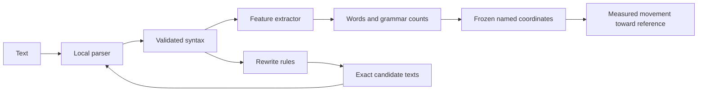

# Grammar and word occurrence

A fresh Rust workspace for slopninja, describing text and enumerating edits
without an LLM. The default representation includes word frequencies, grammatical patterns
and structural measurements. Python supplies the local spaCy dependency parser
and PyTorch model-size experiments. Feature extraction, vector geometry and
edit generation work in Rust; saved annotations can be processed without
loading any model.

The base is separate from the earlier CLI in `../src/`. There are five crates:

| Crate | Responsibility |
| --- | --- |
| `grammar-core` | Validated syntax, replaceable feature extraction, frozen vector spaces, exact patches and deterministic rewrite rules |
| `grammar-spacy` | Annotate original text with the installed parser and translate Unicode character offsets to checked UTF-8 byte spans |
| `grammar-cli` | Save annotations, extract features, fit/project spaces and materialize edit neighborhoods |
| `grammar-corpus` | Import local author corpora, retain source provenance and word counts, and export dated reference samples |
| `grammar-eval` | Compare word, grammar and combined author profiles on held-out posts using shared geometry and fixed ablations |



The default extractor has fourteen families. `word` and `word_bigram` count NFC
lowercased letter words with internal apostrophes; digits and hyphens separate
words. Bigrams stop at sentence boundaries. Grammar uses the parser's alphabetic
tokens: POS and detailed tags, dependency relations, POS bigrams/trigrams,
morphological bundles, parent paths of up to two/three edges, complete ordered
head frames, clause-head frames, and two families of dependency/sentence load
measurements. Paths retain early roots; frames keep repeated children without
truncation. See `features.rs` for the precise keys and denominators.

Every family retains integer counts and opportunities, or named measurements
with physical scale floors. Zero opportunities means unavailable. Fitting or
projecting an active unavailable family fails; a caller must explicitly disable
it to use a reduced space. The engine never treats missing coverage as a match.

The first geometry assigns half the total weight to word occurrence and half to
grammar. Family weights are configurable. For a categorical distribution, each
coordinate is `sqrt(weight / 2) * sqrt(count / opportunities)`. Its squared
Euclidean contribution is weighted squared Hellinger distance. Each reference
work contributes equally; excerpts within a work share that work's weight. The
target uses the average reference probabilities, followed by the square-root
transform. It is a probability-profile target, not the mean of transformed points.

For numerical metrics, subtract the reference-group mean and divide by the
larger of its population standard deviation or declared physical scale floor.
Multiply by `sqrt(weight / number_of_family_axes)`. Fixed-catalog rates use the
same transform with a 0.01 floor. The overall score is Euclidean distance in the
published coordinates. It is unbounded when numerical families are active and
is not a probability or an AI detector score.

Reference documents alone fit target probabilities and scales. Source/candidate
features extend the categorical dictionary, so previously unseen words and
patterns retain their own axes. Additional categorical axes cannot dilute a
family's contribution. Rates and metrics have fixed catalogs. Any basis change
creates a new content-addressed space identity; all compared points must use
that same space. Projecting an unknown coordinate into a frozen space fails.

Run from this directory after installing the parent's pinned parser environment:

```sh
cargo build --release
target/release/unslop-grammar rules
target/release/unslop-grammar neighborhood examples/source.txt \
  --references examples/references.jsonl --max-candidates 16 \
  --out ../data/grammar-demo/run-001
```

The bundled samples are assistant-written synthetic fixtures, not human
authorship evidence. A reference manifest is JSONL with `id`, `path`,
`source_group`, `split`, `authorship`, `author_id` and optional `provenance`.
Paths are relative to the manifest. Only `train` rows fit the profile. Duplicates,
source groups crossing splits and mixed training authors are rejected.

Each run writes the exact source annotation, raw feature records, reference
audit, every generated candidate, a frozen `space.json`, and `report.json`.
The report includes full positions, family distances and every changed
coordinate's contribution. Positive `distance_improvement` means closer to the
reference target. Negative results and parser failures remain visible. The
source is the unchanged baseline, and output files are never overwritten.
The run also saves source/manifest snapshots, per-reference audits, immediate
candidate failure records and an append-only `events.jsonl`. A failed run keeps
its error and prior artifacts. Choose a fresh output directory for another run.

The [recorded synthetic example](examples/demo-result.json) has 391 axes. Its
three candidates changed 51 to 213 coordinates each. Splitting a coordination
moved the distance from 0.761833 to 0.749599; the other two edits produced smaller
improvements. These figures demonstrate measurement on fixtures, not validated
human style matching or detector reduction.

The neighborhood is one application of a rule per candidate. Enumeration takes
turns across rule families so frequent contractions cannot consume the entire
candidate budget before structural rules get a turn. Initial rules
cover unambiguous negative contractions/expansions, guarded present passive
relative reduction, independent coordination/semicolon splits, and sentence
joins. Every candidate records exact byte patches and remaining risks. A closer
position does not establish preservation of meaning or tone. The engine reports
no automatic recommendation. Read the [linguistic guards](../docs/deterministic-grammar.md).

For a parser-free geometry workflow, `fit` reads a JSON array of core `Reference`
objects (`source_group` plus serialized `Features`), with optional repeated
`--basis FEATURES.json` inputs. `project` reads saved `Features` and `--space`.
`features INPUT --annotated` extracts features from a saved core `Document`.
Use `--help` on each command for its paths. `--python` selects the parser
interpreter; by default it uses the parent's `.venv/bin/python`.

Miners can eventually propose alternative extractors, grammatical vocabularies,
geometry and operators. `FeatureExtractor` and `RewriteRule` are core extension boundaries;
feature schema, parser identity, rule catalog version and fitted-space hash
identify what was used. There is no dynamic plugin loader or subnet runtime in
this workspace yet. Validators will need fixed external tasks to compare
representations: a miner's smaller distance in its own space is not evidence of
better writing. Useful accepted edits, fidelity, readability and resource cost
need independent evaluation on source groups excluded from fitting.

Keep private source text, excerpts, profiles and materialized edits under the
parent's ignored `data/` directory. This includes local correspondence imports.

For experiments with many authors, the [local Blog Authorship workflow](../docs/blog-corpus.md)
imports the original archive into SQLite and exports separate author manifests.
The importer uses the core word tokenizer. Reference writing from the blogging
era is acceptable; corpus files and derived profiles stay under ignored `data/`.

The [author retrieval evaluator](crates/grammar-eval/README.md) compares the
current fourteen-family representation with word-only, grammar-only and
content-lemma TF-IDF baselines. It fits numerical scales and author targets from
training posts, then ranks authors for chronological development and test posts.
All variants use the same eligible posts. Exact annotations, exclusions, full
rankings and bootstrap intervals remain available for inspection. Author
retrieval measures distinguishability on this corpus; it does not establish
readability, meaning preservation or detector performance.

The evaluator also supports [training a small feature-weight model](../docs/learned-metric.md).
It learns positive weights for the fourteen existing families using original
authors, then evaluates the frozen choice on a disjoint author cohort. The
`Space::extend_basis` API retains fitted transforms when adding new vocabulary.
Training stability diagnostics and learned weights are separate from feature
extraction, so the underlying grammar remains available for later experiments.
The [model-size frontier](../docs/model-size-frontier.md) compares these positive
weights with monotone calibration and larger neural scorers, retaining the
same fourteen input distances.

The [coordinate-weighting experiment](../docs/coordinate-weighting.md) adds
individual weights for 1,864 supported words, word pairs and grammatical
features. The Rust exporter preserves the complete family distances and
unselected vocabulary, while PyTorch learns bounded corrections around the
frozen family model. It uses the existing author-disjoint validation cohort
and three fresh test galleries.

The [coordinate capacity study](../docs/coordinate-frontier.md) extends this
to nested vocabularies and separately trainable word and grammar groups.
All variants retain the complete original distances and numerical scales.
Rust exports one maximal catalog with named subset indices, so every model
uses the same underlying geometry.
The selected 3,557-weight model improved on the incumbent by 1.91 points on
300 new authors, with a paired 95% interval of [-0.04, +3.69]. For that study,
the incumbent remained the reference. It supports [Rust inference](../docs/coordinate-inference.md)
through `slop_ninja-score`, without a tensor runtime.

The [training-author scale study](../docs/training-author-scale.md) fits the same
3,557 coordinates on 300 authors across three fixed panels. Accuracy improved
from 54.72% to 56.30% on 600 new test authors, with a paired difference interval
of [+0.51, +2.69] points. Every panel retains 100 candidate authors and the
original geometry. The [fixed-panel exporter](../docs/fixed-coordinate-panels.md)
applies the frozen catalog to additional cohorts without fitting new support
thresholds or scales. Grammar corrections supplied little conditional top-1
gain, so the representation still needs investigation beyond author retrieval.
The selected 300-author model now has [portable Rust inference](../docs/scale-coordinate-inference.md).
All 3,618 seed/query rankings agree exactly with Python, while retaining
unselected vocabulary and the original numerical scales. A separate
[content-proxy diagnostic](../docs/content-proxy-diagnostic.md) groups the
saved predictions by content advantage, preserving the same frozen models.

The [complete-family ablation](../docs/full-family-ablation.md) finds a
2.39-point contribution from the complete grammar component in this model.
The [representation audit](../docs/grammar-representation-audit.md) identifies
sparse full clause frames as a candidate for improvement. The new
`CompositionalExtractor` adds the versioned `clause_child_backoff_v1` family
and preserves every original family. Each clause head contributes one event
per lexical direct child, or one EMPTY event when it has none. A new schema
identity separates these fifteen-family features from the existing model's
fourteen-family inputs. The [matched calibration study](../docs/clause-family-study.md)
found a +0.007-point gain on 397 new authors, with a paired interval crossing
zero. The additional family remains available for representation research.

Two further opt-in feature modules describe choices absent from the original
families. [Function-word roles](../docs/function-word-roles.md) connect parser
lemmas to local grammatical roles. [Predicate operators](../docs/predicate-operators.md)
retain auxiliary, copular and negation sequences with finite-carrier evidence.
Both use explicit event denominators and preserve missing annotations. The
[TRAIN support audit](../docs/grammar-choice-support.md) records recurrence and
coverage across 3,889 posts from 300 authors. The
[edit-utility notes](../docs/edit-utility-matrix.md) map these observations to
existing rewrite rules and the separate checks needed for meaning preservation.
The [claim guard](../docs/claim-preservation.md) checks exact source-patch
correspondence and keeps local operators separate from content and scope.
Its evaluation retains the source unless the observations are preserved and
the frozen author score strictly improves. The
[association diagnostic](../docs/grammar-association.md) compares the two new
families with simpler marginals and inventory controls on existing TRAIN data.

The [conditional preference study](../docs/conditional-edit-preferences.md)
connects observed negative-contraction choices to exact proposals.
`edit_choice_observation.rs` enumerates the original rule descriptors without
the search cap. `edit_preference_model.rs` estimates context probabilities with
explicit support and predicts excluded-date choices. The
`slop_ninja-edit-preferences` command retains observations, full author profiles
and a separate synthetic application of the claim guard. These probability
profiles cover declared alternatives; they do not define a semantic distance.
`slop_ninja-preference-chronology` tests unchanged TRAIN profiles on existing
later posts from the same authors, retaining null coverage rows and descriptive
DEV/TEST breakdowns. The [later-post results](../docs/preference-chronology.md)
show an 8.1% reduction in Brier loss from personalization.
`slop_ninja-preference-score-comparison` compares each target author's exact
form preference against the frozen neural score, with claim-guard decisions
recorded separately. The [synthetic comparison](../docs/preference-score-comparison.md)
found substantial disagreement between those two objectives.
`slop_ninja-boundary-eligibility` enumerates raw period/semicolon sites and
uncapped original-rule proposals, then checks parsed inverses and both claim
guards. The [TRAIN eligibility screen](../docs/boundary-choice-eligibility.md)
retained every source and rejection but found no paired eligible edits.
The observer and evidence reports are available for parser/rule diagnostics;
they do not yet supply usable structural preference observations.
`slop_ninja-parser-variants` compares pinned parser configurations on the same
synthetic boundary pairs, checking historical replay and environment equality
before interpreting differences. The [four-configuration screen](../docs/parser-variants.md)
found no eligible paired edit in any configuration. The reports retain direct
guard checks for excluded cases even when no rule emits the requested edit.
`slop_ninja-boundary-view` compares local clause trees across exact period and
semicolon alternatives. The [boundary-view study](../docs/boundary-view.md)
retains the original crossing edge and each token's original parent alongside
the local comparison. It reports attribution uncertainty and runs the existing
claim guard separately; structural agreement does not license an edit.
`slop_ninja-lexical-frames` imports a pinned VerbNet XML resource and records
frame-specific argument bindings while retaining every alternative, restriction
and original parser attachment. Its [synthetic study](../docs/lexical-frames.md)
separates complete syntax from unresolved semantic compatibility, tests missing
coverage with explicit masks, and compares controlled participant changes with
word counts. The resource importer and matching logic are Rust; the existing
spaCy bridge supplies annotations. No new author-style feature family or edit
license has been added.
`slop_ninja-lexical-frame-parsers` compares saved lexical-frame outputs from
four pinned parser configurations. The [comparison](../docs/lexical-frame-parsers.md)
retains exact predicate spans, separates complete and partial role assertions,
and checks embedded participant occurrences when names repeat. Larger parsers
increased target coverage on the fresh texts, while unsupported prepositional
`dative` labels caused some transformer bindings to become incomplete.
`slop_ninja-lexical-frame-datives` tests an explicit mapping version for that
prepositional form. Its [study](../docs/lexical-frame-datives.md) requires exact
baseline replay before comparing both mappings on identical annotations.
The shared observer retains its baseline APIs; extended reports carry a
separate schema and mapping identity. Complete bindings for specified roles
remain distinct from shorter alternative frames and unresolved semantics.

`slop_ninja-dative-alternation` generates both directions of the pinned dative
frame pair and checks exact participant occurrences after reparsing. Its
[study](../docs/dative-alternation.md) preserves both older mappings, retains
all proposals and rejected sites, and records sparse word-and-grammar vectors
under frozen author geometry. Raw and appended-context scores remain separate;
missing grammar families are unavailable. No distance licenses an edit.

`slop_ninja-dative-corpus` audits all 3,889 existing training posts under the
transformer and cached small parser. Its [report](../docs/dative-corpus.md)
separates verb exposure, complete frames, proposals and reciprocal checks,
preserving all posts and incomplete assessments in the support calculation.
The transformer found 169 complete constructions, one proposal and no
reciprocally confirmed edits. The fixed support threshold failed at every
tier; no preference model was fitted.

`slop_ninja-dative-arguments` adds an optional role-aware phrase policy while
retaining the original default. The [experiment](../docs/dative-arguments.md)
checks fresh reciprocal fixtures and reuses both parsers' whole-post corpus
annotations. Phrase assessment, exact movement and reciprocal comparison
remain separate; no policy result establishes semantic equivalence.
On the corpus, the transformer passed two of 60 proposals and the small parser
passed 32 of 63. The fixed synthetic exclusions exposed an accepted movement
of fused abbreviation/terminal punctuation. Missing case features also caused
otherwise matching positive comparisons to fail. These remain recorded
limitations; neither parser met the preference-model support threshold.

`slop_ninja-parser-repeat` runs [identical-text controls](../docs/parser-repeat.md)
on the same 117 source and candidate texts under both pinned parsers. It retains
adjacent repeats and fresh-process comparisons, including reversed input order,
and reports missing historical annotations separately. The comparator anchors
tokens and dependency heads by byte occurrence, distinguishing index shifts
from structural differences.
Both parsers matched every controlled repeat and available historical reference.
The preceding source/candidate disagreements remain unexplained by these
identical-text controls.

`slop_ninja-sentence-context` supplies that [diagnostic](../docs/sentence-context.md).
It preserves exact source-defined sentence slices and patches, records missing
full-sentence projections, and evaluates saved projections and isolated parses
with the same regenerated proposal and reciprocal checks. Both views passed
32 of 60 primary cases, versus two under the unchanged whole-post gate. The
experiment retains all cases and does not authorize local passes to override
that gate.

`slop_ninja-evidence-contracts` compares [revised structural evidence](../docs/evidence-contracts.md)
against those saved results, distinguishing missing morphology, sentence
membership and terminal punctuation inside tokens. Primary saved-sentence
acceptance rose from 32 to 44 of 60; the original comparison API remains the
default. The new `freeze` and `run` commands also evaluate fresh synthetic pairs.

```sh
cargo fmt --check
cargo test --workspace
cargo clippy --workspace --all-targets -- -D warnings
```

The integration suite uses the installed local parser when available. Tests
make no generation or detector requests. Parsing errors remain a limitation:
strict rules can miss valid edits, and licensed edits still need preservation
review. No detector improvement is established by this workspace.
